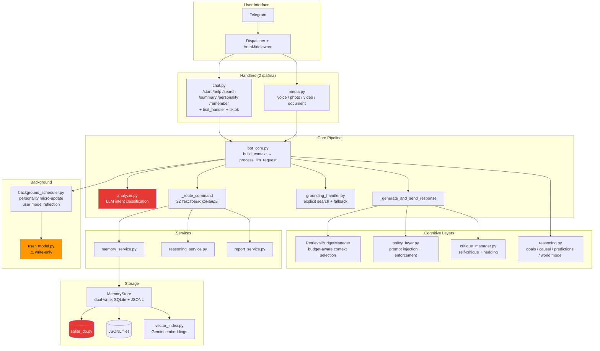

# AI Companion Migration Plan V2

**Дата:** 2026-06-30
**Статус:** Post-refactoring audit — актуальное состояние после глобальной чистки

---

## Краткое резюме изменений с V1

Старый `AI_COMPANION_MIGRATION_PLAN.md` описывал 40+ slash-команд и полностью отключённые когнитивные слои. С тех пор:

- **Удалены все мусорные обработчики**: `handlers/memory.py`, `handlers/analytics.py`, `handlers/reasoning.py`, `handlers/diagnostics.py` — полностью вырезаны.
- **Handlers сокращены до двух файлов**: `chat.py` (текст + TikTok) и `media.py` (голос, фото, видео, документы).
- **Создан сервисный слой**: `services/memory_service.py`, `services/reasoning_service.py`, `services/report_service.py`.
- **Все бывшие slash-команды** (facts, goals, timeline, todo и т.д.) **конвертированы в текстовые интенты** через LLM-анализатор (`llm/analyzer.py`) + `_route_command()` в `bot_core.py`.
- **Когнитивные слои интегрированы**: goals, causal links, predictions, world model — всё попадает в LLM-промпт через `ContextBundle.to_prompt_block()`.
- **Self-critique подключён**: `critique_manager.py` работает в пайплайне, модифицирует текст ответа и может тригерить grounding fallback.
- **Policy layer активен**: `from_analyzer_state()` → `decide_policy()` → inject в промпт + `enforce_constraints()` пост-процессом.

---

## 1. Актуальный инвентарь команд

### 1.1 Оставшиеся Slash-команды (6 штук)

Зарегистрированы в `handlers/__init__.py:20-28` через `BotCommand`:

| Команда | Handler | Файл | Описание |
|---|---|---|---|
| `/start` | `cmd_start` | `handlers/chat.py:57` | Приветствие + inline keyboard |
| `/help` | `cmd_help` | `handlers/chat.py:66` | HTML-справка с текстовыми интентами |
| `/search <запрос>` | `cmd_search` | `handlers/chat.py:84` | Принудительный Google Search с grounding |
| `/summary` | `cmd_summary` | `handlers/chat.py:71` | Ручное сжатие / показ последнего саммери |
| `/personality` | `cmd_personality` | `handlers/chat.py:75` | LLM-генерация профиля личности |
| `/remember <текст>` | `cmd_remember` | `handlers/chat.py:78` | Сохранение permanent note + факт |

### 1.2 Команды, конвертированные в текстовые интенты

Маршрутизация: `analyzer.py` → `intent=command` + `command=<name>` → `bot_core._route_command()` (L232-291).

| Текстовый запрос | command ID | Сервис |
|---|---|---|
| «что ты обо мне помнишь» | `show_facts` | `memory_service.show_facts` |
| «покажи постоянную память» | `show_notes` | `memory_service.show_notes` |
| «экспортируй дневник» | `export_diary` | `memory_service.export_diary` |
| «покажи хронологию» | `show_timeline` | `memory_service.show_timeline` |
| «что было в 2025» | `show_year` | `memory_service.show_year` |
| «сбрось контекст» | `reset_context` | `reasoning_service.reset_context` |
| «какие у меня цели» | `show_goals` | `reasoning_service.show_goals` |
| «моя цель — ...» | `add_goal` | `reasoning_service.add_goal_from_text` |
| «покажи состояние разума» | `show_reasoning` | `reasoning_service.show_reasoning_state` |
| «кто ты» | `self_description` | `reasoning_service.show_self_description` |
| «карта знаний» | `knowledge_map` | `reasoning_service.show_selfmap` |
| «покажи задачи» | `show_todos` | `reasoning_service.show_todos` |
| «добавь задачу ...» | `add_todo` | `reasoning_service.add_todo` |
| «отметь N как готово» | `complete_todo` | `reasoning_service.complete_todo` |
| «удали задачу N» | `delete_todo` | `reasoning_service.delete_todo` |
| «очисти выполненные» | `clear_done` | `reasoning_service.clear_done_todos` |
| «запиши в дневник ...» | `diary_entry` | `memory_service.add_diary_entry` |
| «сделай сводку недели» | `week_digest` | `report_service.show_week_digest` |
| «ретроспектива» | `retrospective` | `report_service.show_retrospective` |
| «сделай психопортрет» | `selfie` | `report_service.show_selfie` |
| «собери главу за ...» | `monthbook` | `report_service.show_monthbook` |
| «покажи контекст» | `show_context` | `report_service.show_context` |

### 1.3 Полностью вырезанные slash-команды

Эти команды **не существуют** нигде в текущем коде — ни как handlers, ни как интент-роуты:

| Команда | Статус |
|---|---|
| `/code` | Удалена (был diagnostics) |
| `/logs` | Удалена |
| `/dbinfo` | Удалена |
| `/errors` | Удалена |
| `/stats` | Удалена |
| `/memory_audit` | Удалена |
| `/yearbook` | Удалена |
| `/mood` | Автоматизирована через `analyzer.py` |
| `/causal` | Автоматизирована через `reasoning_engine` |
| `/predict` | Автоматизирована через `reasoning_engine` |
| `/confidence` | Автоматизирована через `critique_manager` |
| `/addevent` | Автоматизирована через `memory_service.auto_add_event_from_message` |
| `/moodweek` | Удалена (нет ни handler, ни intent route) |

### 1.4 Удалённые файлы-обработчики

| Файл | Статус |
|---|---|
| `handlers/memory.py` | Удалён — логика переехала в `services/memory_service.py` |
| `handlers/analytics.py` | Удалён — логика переехала в `services/report_service.py` |
| `handlers/reasoning.py` | Удалён — логика переехала в `services/reasoning_service.py` |
| `handlers/diagnostics.py` | Удалён полностью |
| `intents.py` | Пустой stub с docstring — вся классификация в `llm/analyzer.py` |

---

## 2. Статус интеграции когнитивных слоёв

### 2.1 End-to-End Response Pipeline

```
Сообщение → build_context()
  ├── analyze_message() [LLM]     → intent, mood, importance, user_state, command
  ├── log_message()                → SQLite + JSONL
  ├── auto_reasoning_context()     → goals, causal, predictions, world model
  ├── auto_add_event_from_message()→ авто-создание событий
  ├── _get_policy_decision()       → PolicyDecision из analyzer state
  └── _load_retrieval_context()    → ctx_data dict со всеми когнитивными данными

→ _route_command() если intent=command, confidence ≥ 0.92
→ handle_grounding() если явный поисковый запрос
→ _generate_and_send_response()
    ├── retrieval_mgr.select()     → ContextBundle (все когнитивные фичи)
    ├── bundle.to_prompt_block()   → текст для LLM
    ├── _build_user_prompt_block() → causal/future reasoning hints
    ├── format_prompt_with_policy()→ ═══ RESPONSE POLICY ═══
    ├── chat.send_message()        → LLM call
    ├── enforce_constraints()      → пост-процессинг ответа
    ├── run_self_critique()        → мета-оценка ответа
    ├── apply_critique_to_text()   → хеджирование неуверенности
    ├── should_retry_with_grounding() → fallback если confidence < 0.55
    └── background_user_model_reflection() → фоновое обновление user model
```

### 2.2 Что реально включено в LLM-промпт

| Фича | В промпте? | Механизм |
|---|---|---|
| Active goals | ✅ ДА | `[Активные цели]` секция в `ContextBundle.to_prompt_block()` |
| Causal links | ✅ ДА | `[Причинно-следственный контекст]` секция |
| Predictions | ✅ ДА | `[Прогнозы и ожидания]` секция |
| World model | ✅ ДА | `[Модель мира]` секция |
| Facts | ✅ ДА | `[Релевантные факты]` секция |
| Reflections | ✅ ДА | `[Выводы о пользователе]` секция |
| Personality | ✅ ДА | `[Снимок личности]` в system instruction |
| Master summary | ✅ ДА | `[Master Summary]` в system instruction |
| Policy constraints | ✅ ДА | `═══ RESPONSE POLICY ═══` в промпте + пост-процессинг |
| Causal reasoning mode | ✅ ДА | `[Режим reasoning]` hint при `causal_trigger=True` |
| Future reasoning mode | ✅ ДА | `[Режим reasoning]` hint при `future_trigger=True` |
| Self-critique | ⚠️ КОСВЕННО | Не в промпте, но модифицирует ответ пост-фактум |
| User model (identity) | ❌ НЕТ | Write-only — пишется в JSON, никогда не читается в промпт |

### 2.3 Что починено с V1

| Проблема из V1 | Статус |
|---|---|
| Goals/causal/predictions не используются в ответах | ✅ ИСПРАВЛЕНО — полностью интегрированы |
| Self-critique не подключён | ✅ ИСПРАВЛЕНО — `critique_manager` работает в пайплайне |
| Policy layer не применяется | ✅ ИСПРАВЛЕНО — inject + enforce работают |
| Retrieval не фильтрует контекст | ✅ ИСПРАВЛЕНО — `RetrievalBudgetManager` с бюджетом и приоритетами |
| Handlers перемешаны с бизнес-логикой | ✅ ИСПРАВЛЕНО — сервисный слой создан |
| Мусорные команды в меню | ✅ ИСПРАВЛЕНО — осталось 6 высокоценных |

---

## 3. Выявленные проблемы текущего кода

### 3.1 🔴 Критические

#### 3.1.1 Утечка фоновых задач в `main.py`

**Файл:** `companion/main.py:74`

```python
asyncio.create_task(proactive_ping_loop(bot))
```

Задача `proactive_ping_loop` создаётся fire-and-forget — ссылка на task нигде не сохраняется. При завершении бота (`finally` блок L78-81) задача **не отменяется**. Также `proactive_ping_loop` содержит бесконечный `while True` с `asyncio.sleep(1800)` и ловит все исключения, перезапускаясь — зомби-задача.

Та же проблема в `background_scheduler.safe_task()` (L36-54): все `asyncio.create_task()` fire-and-forget без хранения ссылок. Python может логировать "Task exception was never retrieved" если задача падает между итерациями semaphore.

#### 3.1.2 N+1 в `search_facts` — O(results × facts)

**Файл:** `memory/store.py:97-130`

```python
for r in results:                    # каждый результат вектора
    for f in self.list_facts("active"):  # ПЕРЕЧИТЫВАЕТ ВСЕ факты из БД!
        if f.fact == r["content"]:
            ...
```

При 20 результатах поиска и 1000 фактов = 20 × 1000 = **20 000 сравнений + 20 отдельных SQL-запросов**. Самый тяжёлый баг в кодовой базе.

#### 3.1.3 Отсутствие timeout у `oneshot()` в compress pipeline

**Файл:** `llm/pipeline.py` — функции `extract_facts`, `consolidate_facts`, `generate_reflections`, `generate_personality_snapshot` — все вызывают `llm.oneshot()` напрямую, **минуя** `run_llm()` wrapper.

Один compress pipeline может выполнить **5+ последовательных LLM-вызовов** без timeout. Если Gemini API зависнет — весь пайплайн заблокируется навечно.

#### 3.1.4 Отсутствие timeout у `analyze_message()`

**Файл:** `llm/analyzer.py:38`

```python
raw = oneshot(prompt, MODEL_NAME)  # блокирующий, без timeout!
```

Вызывается в **горячем пути** обработки каждого сообщения (через `asyncio.to_thread`, но сам `oneshot` без timeout). Зависание API = бот перестаёт отвечать.

#### 3.1.5 Connection-per-operation в SQLite

**Файл:** `storage/sqlite_db.py`

Каждый `_insert_fact`, `_insert_message` и т.д. открывает **новое** SQLite-соединение:

```python
def _insert_fact(self, row):
    with self._conn() as conn:  # новое соединение
        conn.execute(...)
    # закрытие соединения
```

При JSONL-миграции (`_migrate_jsonl_if_empty`) это создаёт **N соединений для N строк**. Нет connection pooling, нет batch insert, нет WAL mode.

### 3.2 🟠 Высокие

| # | Проблема | Файл | Описание |
|---|---|---|---|
| H1 | `rotate_jsonl` после каждого write | `memory/store.py` (L69,85,135,164,184) | Полный подсчёт строк O(n) при каждом append |
| H2 | `find_similar_fact` — O(n) полный скан | `memory/store.py:143-153` | Итерирует ВСЕ активные факты для n-gram сравнения |
| H3 | Нет WAL mode для SQLite | `storage/sqlite_db.py:24` | Читатели блокируются во время записи |
| H4 | Zero-vector embedding кешируется навсегда | `memory/vector_index.py:30-31` | При сбое API сохраняются нулевые вектора, никогда не обновляются |
| H5 | `_aio_client` не потокобезопасен | `llm/client.py:185-194` | TOCTOU race на `_aio_client is None` |
| H6 | Personality `changes` список растёт без лимита | `llm/pipeline.py:248` | `old_changes + new_changes` без cap |
| H7 | User model — write-only | `user_model.py` | Модель пишется в JSON, но **нигде не читается** в промпт |

### 3.3 🟡 Средние

| # | Проблема | Файл | Описание |
|---|---|---|---|
| M1 | Нет ротации для diary/summaries/notes/mood | `storage/legacy.py` | Файлы растут без лимита |
| M2 | Brute-force vector search | `memory/vector_index.py:138-162` | Загружает все embeddings в память, O(n) сравнение |
| M3 | `facts_for_period` сканирует все факты | `memory/store.py:239-245` | `list_all_facts()` → Python filter вместо SQL WHERE |
| M4 | `get_week_diary` — полный скан diary.txt | `storage/legacy.py` | Ищет записи за 7 дней во всём файле |
| M5 | Баг в логе `reindex_all` | `memory/store.py:299` | Логирует `counts["beliefs"]` вместо `counts["reflections"]` |
| M6 | Дупликат паттерна в grounding.py | `llm/grounding.py:34-35` | `\bмоя жизнь\b` дважды в `MEMORY_PATTERNS` |
| M7 | `message_signals` в RuntimeState | `runtime_state.py:12` | Объявлено, никогда не заполняется |
| M8 | Race condition на todos | `services/reasoning_service.py` | load → modify → save без file lock |

### 3.4 Мёртвый код

| Расположение | Код | Тип |
|---|---|---|
| `reasoning.py:472-527` | `build_situation_model()` | Никогда не вызывается извне |
| `reasoning.py:529-548` | `analyze_causality()` | Никогда не вызывается извне |
| `reasoning.py:550-577` | `get_predictions_summary()` | Никогда не вызывается извне |
| `reasoning.py:427-444` | `get_causal_chain()` | Только из мёртвого `analyze_causality()` |
| `policy_layer.py:311-361` | `detect_user_state()` | Заменён на `from_analyzer_state()` |
| `self_model.py:151-153` | `get_confidence(domain)` | Никогда не вызывается |
| `runtime_state.py:12` | `message_signals` | Никогда не заполняется |
| `background_scheduler.py:28-33` | `_run_background_task()` | Дублирует `safe_task()`, не используется |

---

## 4. Рекомендуемые фазы миграции V2

> Фокус: **бэкенд-оптимизация и устранение критических проблем**. Фронтенд (command surface) уже в хорошем состоянии после рефакторинга.

### Phase 1: Исправление утечки фоновых задач в `main.py`

**Приоритет:** 🔴 Критический
**Scope:** `main.py`, `background_scheduler.py`, `bot_core.py`

#### 1.1 Трекинг фоновых задач

Заменить fire-and-forget `asyncio.create_task()` на managed task registry:

```python
# background_scheduler.py
_active_tasks: set[asyncio.Task] = set()

def safe_task(coro, task_name: str = "background") -> asyncio.Task:
    async def _wrapped():
        async with _background_semaphore:
            try:
                await coro
            except Exception as e:
                logger.exception("Background task '%s' failed: %s", task_name, e)
    task = asyncio.create_task(_wrapped(), name=task_name)
    _active_tasks.add(task)
    task.add_done_callback(_active_tasks.discard)
    return task

async def cancel_all_tasks():
    for task in _active_tasks:
        task.cancel()
    await asyncio.gather(*_active_tasks, return_exceptions=True)
    _active_tasks.clear()
```

#### 1.2 Graceful shutdown в `main.py`

```python
# main.py — в run()
ping_task = asyncio.create_task(proactive_ping_loop(bot))
try:
    await dp.start_polling(bot, handle_as_tasks=True)
finally:
    ping_task.cancel()
    await cancel_all_tasks()          # ← новое
    await bot.session.close()
```

#### 1.3 Удалить мёртвый `_run_background_task()`

Функция `_run_background_task` в `background_scheduler.py:28-33` дублирует `safe_task()` и нигде не используется.

**Файлы:**
- `companion/main.py`
- `companion/background_scheduler.py`

---

### Phase 2: Пакетная вставка и connection pooling в `sqlite_db.py`

**Приоритет:** 🔴 Критический
**Scope:** `storage/sqlite_db.py`, `memory/store.py`, `memory/vector_index.py`

#### 2.1 Включить WAL mode

```python
def _conn(self):
    conn = sqlite3.connect(self.path)
    conn.execute("PRAGMA journal_mode=WAL;")
    conn.execute("PRAGMA foreign_keys = ON;")
    conn.row_factory = sqlite3.Row
    return conn
```

#### 2.2 Batch insert методы

Добавить пакетные варианты для массовых операций:

```python
def batch_insert_facts(self, rows: list[dict]) -> None:
    with self._conn() as conn:
        conn.executemany(
            "INSERT OR IGNORE INTO facts VALUES (?,?,?,?,?,?,?,?,?,?,?,?,?,?)",
            [self._fact_tuple(r) for r in rows]
        )

def batch_insert_messages(self, rows: list[dict]) -> None:
    with self._conn() as conn:
        conn.executemany(
            "INSERT OR IGNORE INTO messages VALUES (?,?,?,?,?,?,?,?)",
            [self._message_tuple(r) for r in rows]
        )
```

#### 2.3 Рефакторинг JSONL-миграции

Текущий `_migrate_jsonl_if_empty` вызывает `_insert_fact` (с новым connection) для каждой строки. Заменить на batch:

```python
def _migrate_jsonl_if_empty(self):
    with self._conn() as conn:
        if conn.execute("SELECT COUNT(*) FROM facts").fetchone()[0] > 0:
            return
    # batch-миграция
    for path, table, batch_method in (...):
        if os.path.exists(path):
            rows = list(read_jsonl(path))
            batch_method(rows)  # один INSERT OR IGNORE для всех строк
```

#### 2.4 Добавить недостающие индексы

```sql
CREATE INDEX IF NOT EXISTS idx_fact_relations_from ON fact_relations(from_id);
CREATE INDEX IF NOT EXISTS idx_fact_relations_to ON fact_relations(to_id);
CREATE INDEX IF NOT EXISTS idx_reflections_period ON reflections(period);
CREATE INDEX IF NOT EXISTS idx_messages_user_id ON messages(user_id);
```

#### 2.5 `rotate_jsonl` — не вызывать на каждый write

Текущий код вызывает `rotate_jsonl` после **каждого** `append_jsonl` — O(n) подсчёт строк. Заменить на:
- Счётчик в памяти (инкрементируется при append)
- Проверка ротации каждые 100 writes или по таймеру

**Файлы:**
- `companion/storage/sqlite_db.py`
- `companion/memory/store.py`
- `companion/storage/jsonl.py`
- `companion/memory/vector_index.py`

---

### Phase 3: Доработка тайм-аутов LLM в `client.py` и `pipeline.py`

**Приоритет:** 🔴 Критический
**Scope:** `llm/client.py`, `llm/pipeline.py`, `llm/analyzer.py`, `llm/master_summary.py`

#### 3.1 Обернуть все `oneshot()` вызовы в `run_llm()`

Текущая ситуация: `run_llm()` — единственная функция с timeout и retry, но множество мест вызывают `oneshot()` напрямую.

| Вызывающий | Файл:строка | Текущий вызов | Нужно |
|---|---|---|---|
| `analyze_message` | `analyzer.py:38` | `oneshot(prompt)` | `run_llm(oneshot, prompt)` — **но** вызывается из `asyncio.to_thread`, поэтому нужен sync wrapper с timeout |
| `extract_facts` | `pipeline.py:39` | `llm.oneshot(prompt)` | `run_llm_sync(oneshot, prompt)` |
| `consolidate_facts` | `pipeline.py:104` | `llm.oneshot(prompt)` | `run_llm_sync(oneshot, prompt)` |
| `generate_reflections` | `pipeline.py:146` | `llm.oneshot(prompt)` | `run_llm_sync(oneshot, prompt)` |
| `generate_personality_snapshot` | `pipeline.py:189` | `llm.oneshot(prompt)` | `run_llm_sync(oneshot, prompt)` |
| `update_master_summary` | `master_summary.py:77` | `llm.oneshot(prompt)` | `run_llm_sync(oneshot, prompt)` |
| `run_compress_pipeline` | `pipeline.py:260` | `chat.send_message(...)` | Timeout через wrapping |

#### 3.2 Создать sync retry wrapper

Для контекстов, где код уже в thread (pipeline.py работает синхронно внутри `run_llm(run_compress_pipeline, ...)`):

```python
# llm/client.py
import signal

def oneshot_with_timeout(prompt: str, model: str = MODEL_NAME, timeout: int = 90) -> str:
    """oneshot() с таймаутом через threading.Timer fallback."""
    import threading
    result = [None]
    error = [None]

    def target():
        try:
            result[0] = oneshot(prompt, model)
        except Exception as e:
            error[0] = e

    t = threading.Thread(target=target)
    t.start()
    t.join(timeout)
    if t.is_alive():
        raise TimeoutError(f"oneshot timed out after {timeout}s")
    if error[0]:
        raise error[0]
    return result[0]
```

Или проще — переписать `oneshot` на использование `generate_content` вместо создания chat session:

```python
def oneshot(prompt: str, model: str = MODEL_NAME, timeout: int = 90) -> str:
    """Одиночный запрос к модели (без создания chat session)."""
    response = client.models.generate_content(
        model=model,
        contents=prompt,
        config=make_config(),
    )
    return (response.text or "").strip().replace("```json", "").replace("```", "").strip()
```

#### 3.3 `search_with_grounding()` — добавить timeout

```python
def search_with_grounding(query: str, context: str = "", timeout: int = 60) -> tuple[str, str]:
    response = client.models.generate_content(
        model=SEARCH_MODEL,
        contents=prompt,
        config=make_search_config(...),
        # TODO: Gemini SDK не поддерживает нативный timeout;
        # обернуть в threading.Timer или asyncio.wait_for на уровне caller
    )
```

**Файлы:**
- `companion/llm/client.py`
- `companion/llm/pipeline.py`
- `companion/llm/analyzer.py`
- `companion/llm/master_summary.py`

---

### Phase 4: Исправление N+1 в `search_facts` и `find_similar_fact`

**Приоритет:** 🟠 Высокий
**Scope:** `memory/store.py`

#### 4.1 `search_facts` — кеш фактов

```python
def search_facts(self, query: str, limit: int = 20) -> list[Fact]:
    results = self.vector.search(query, top_k=limit, content_type="fact")
    if results:
        # Загружаем факты ОДИН раз
        all_facts = {f.fact: f for f in self.list_facts("active")}
        hits = []
        for r in results:
            f = all_facts.get(r["content"])
            if f and f.id not in seen:
                seen.add(f.id)
                hits.append(f)
        if hits:
            return hits
    # fallback keyword search — тоже один запрос
    ...
```

#### 4.2 `find_similar_fact` — SQL + индексированный поиск

Для дедупликации рассмотреть индекс по первым 50 символам факта или использование vector similarity вместо n-gram:

```python
def find_similar_fact(self, text: str, threshold: float = 0.52) -> Fact | None:
    # Сначала пробуем vector similarity (быстрее O(1) vs O(n))
    results = self.vector.search(text, top_k=3, content_type="fact")
    for r in results:
        if r["score"] >= threshold:
            # Ленивый lookup конкретного факта вместо сканирования всех
            for f in self.list_facts("active"):
                if f.fact == r["content"]:
                    return f
    return None
```

**Файлы:**
- `companion/memory/store.py`

---

### Phase 5: Интеграция User Model в промпт

**Приоритет:** 🟠 Высокий
**Scope:** `user_model.py`, `bot_core.py`, `models.py`

User model (`user_model.py`) сейчас — **write-only журнал**. Данные пишутся через `reflect_after_interaction()`, но **никогда не включаются** в LLM-промпт.

#### 5.1 Добавить `to_prompt_block()` в `UserModel`

```python
def to_prompt_block(self) -> str:
    parts = ["[Модель пользователя]"]
    identity = self.data.get("identity", {})
    if identity.get("who_they_are"):
        parts.append(f"Кто он: {identity['who_they_are']}")
    if identity.get("core_traits"):
        parts.append(f"Черты: {', '.join(identity['core_traits'][:5])}")
    patterns = self.data.get("patterns", {})
    if patterns.get("coping_mechanisms"):
        parts.append(f"Копинг: {', '.join(patterns['coping_mechanisms'][:3])}")
    return "\n".join(parts) if len(parts) > 1 else ""
```

#### 5.2 Включить user model в `ContextBundle`

Добавить `user_model_context` как опциональное поле в `ContextBundle.to_prompt_block()`.

#### 5.3 Улучшить `reflect_after_interaction()`

Текущая реализация использует тривиальный keyword matching ("я есть", "точно", "нет") и не обновляет structured-поля (identity, beliefs, patterns). Заменить на LLM-based reflection:

```python
async def reflect_after_interaction(self, ...):
    # LLM-based analysis вместо keyword matching
    prompt = f"На основе диалога обнови модель пользователя..."
    result = await llm.aio_oneshot(prompt)
    # Парсинг и мерж с текущей моделью
```

**Файлы:**
- `companion/user_model.py`
- `companion/bot_core.py`
- `companion/models.py`

---

### Phase 6: Очистка мёртвого кода и мелкие фиксы

**Приоритет:** 🟡 Средний
**Scope:** Множественные файлы

#### 6.1 Удалить мёртвый код

| Файл | Что удалить |
|---|---|
| `reasoning.py` | `build_situation_model()`, `analyze_causality()`, `get_predictions_summary()`, `get_causal_chain()` |
| `policy_layer.py` | `detect_user_state()` |
| `self_model.py` | `get_confidence()` |
| `runtime_state.py` | Поле `message_signals` |
| `background_scheduler.py` | `_run_background_task()` |
| `intents.py` | Полностью удалить пустой файл |
| `llm/grounding.py` | Дупликат паттерна `\bмоя жизнь\b` |

#### 6.2 Баг в `reindex_all`

```python
# store.py:298-299 — БЫЛО:
logger.info("Reindexed %d facts, %d beliefs, %d reflections, %d causal links",
             counts["facts"], counts["beliefs"], counts["beliefs"], counts["causal_links"])
#                                                ^^^^^^^^ баг — должно быть "reflections"
```

#### 6.3 Cap для `_merge_personality.changes`

```python
# pipeline.py:248 — добавить лимит:
merged["changes"] = (old_changes + new_changes)[-30:]
```

#### 6.4 Ротация legacy-файлов

Добавить ротацию для `diary.txt`, `summaries.txt`, `permanent_notes.txt`, `mood.jsonl` по аналогии с `rotate_jsonl`.

**Файлы:** Все перечисленные выше.

---

## 5. Приоритизация и зависимости

```mermaid
gantt
    title Migration Phases V2
    dateFormat X
    axisFormat %s

    section Critical
    Phase 1 - Task leaks      :p1, 0, 2
    Phase 2 - SQLite batch     :p2, 0, 3
    Phase 3 - LLM timeouts    :p3, 1, 3

    section High
    Phase 4 - N+1 fix         :p4, after p2, 2
    Phase 5 - User model      :p5, after p3, 3

    section Medium
    Phase 6 - Dead code        :p6, after p1, 2
```



| Фаза | Блокирует | Зависит от |
|---|---|---|
| Phase 1 (Task leaks) | — | Ничего |
| Phase 2 (SQLite batch) | Phase 4 | Ничего |
| Phase 3 (LLM timeouts) | Phase 5 | Частично Phase 1 |
| Phase 4 (N+1 fix) | — | Phase 2 |
| Phase 5 (User model) | — | Phase 3 |
| Phase 6 (Dead code) | — | Phase 1 |

---

## 6. Что НЕ нужно трогать

Следующие компоненты работают корректно и не требуют изменений:

| Компонент | Почему оставить |
|---|---|
| `RetrievalBudgetManager` | Бюджетированный retrieval с приоритетами, pinned facts, trimming — хорошо работает |
| `critique_manager.py` | Подключён, модифицирует ответы, тригерит grounding — работает |
| `policy_layer.py` (кроме dead code) | `from_analyzer_state` + `decide_policy` + `enforce_constraints` — полный pipeline |
| `ContextBundle.to_prompt_block()` | Все когнитивные данные сериализуются корректно |
| Command routing через LLM-анализатор | `_route_command()` + confidence gate ≥ 0.92 — надёжная маршрутизация |
| Circuit breaker в `background_scheduler` | 5 failures → 10 min cooldown — хороший паттерн |
| `run_llm()` retry wrapper | Timeout + exponential backoff + retry — правильная реализация |
| Inline keyboard в `/start` | UX хороший, 4 быстрые кнопки |

---

## 7. Архитектурная диаграмма текущего состояния



---

## 8. Executive Summary V2

Проект прошёл через **успешный рефакторинг фронтенда**: command surface чистый, когнитивные слои интегрированы, мусорный код удалён. Бот работает как AI-companion, а не как toolbox.

**Что осталось — это бэкенд-оптимизация:**

1. **Утечки задач** — fire-and-forget tasks без отмены при shutdown
2. **SQLite connection churn** — новое соединение на каждую операцию, нет batch insert, нет WAL
3. **LLM timeout holes** — 6+ мест где `oneshot()` вызывается без timeout, включая горячий путь анализа сообщений
4. **N+1 запросы** — `search_facts` перечитывает все факты для каждого результата vector search
5. **User model — write-only** — единственная крупная когнитивная фича, которая НЕ попадает в промпт

Все эти проблемы решаемы без изменения публичного API бота. Фазы 1-3 (критические) можно реализовать параллельно.
