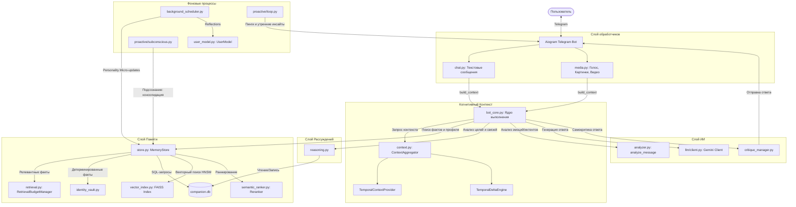

# Техническая документация проекта: AI Companion (Exocortex)

Настоящий документ представляет собой полный технический анализ и архитектурное описание проекта AI-компаньона (также известного как Exocortex / Сын). Документ составлен на основе детального аудита исходного кода и предназначен для разработчиков, желающих понять устройство системы, принципы работы её компонентов и систему управления долгосрочной памятью.

---

# 1. Обзор проекта

- **Название проекта**: Amargon1337/ai-companion (кодовое имя: Exocortex / Сын).
- **Назначение**: Персональный AI-ассистент в Telegram с глубокой долгосрочной памятью, автономной рефлексией и адаптивным поведением.
- **Главная идея**: Создание «экзокортекса» — системы, которая способна запоминать факты о пользователе (Иване), отслеживать изменения в его личности, поведении, интересах и целях, формировать причинно-следственные связи, строить предикты и общаться с пользователем, адаптируя тон под его текущее эмоциональное состояние, исключая эффект затухания контекста.
- **Целевое использование**: Индивидуальный компаньон для ведения дневника, отслеживания личной продуктивности и психологической саморефлексии (включая работу с тревожными и депрессивными состояниями).
- **Общий принцип работы**: Бот принимает текстовые и мультимодальные сообщения через Telegram (Aiogram). Каждое сообщение проходит через фазу структурного анализа (Intent, Mood, Importance). Затем система извлекает из SQLite и FAISS релевантный контекст (профиль личности, активные цели, прошлые факты, эмоциональный фон). Собранный контекст инжектируется в системные инструкции Gemini. При накоплении определенного количества сообщений срабатывает фоновый процесс сжатия (Compress Pipeline), который консолидирует новые факты, строит новые связи, обновляет профиль пользователя и сбрасывает окно истории. Бот также способен проявлять проактивность — инициировать диалог на основе незавершенных целей, эмоционального фона или запланированных задач (Prospective Memory).
- **Используемые технологии**:
  - **Язык программирования**: Python 3.11
  - **Фреймворк Telegram-бота**: Aiogram 3.x
  - **Взаимодействие с LLM**: Google GenAI SDK (модели семейства Gemini)
  - **База данных**: SQLite 3 (с поддержкой режима WAL и триггерами аудита)
  - **Векторный поиск**: FAISS (IndexHNSWFlat + IndexIDMap) с кэшированием в SQLite
  - **Аудиообработка**: SpeechRecognition + Pydub + Google Speech API (для голосовых)
  - **Парсинг документов**: pypdf, python-docx
  - **Загрузка медиа**: yt-dlp
  - **Линтеры**: Ruff, Mypy
- **Модели ИИ**:
  - `gemini-3.1-flash-lite` (Основная текстовая модель для диалога, сжатия, извлечения фактов, рефлексии и анализа сообщений).
  - `gemini-embedding-2` (Модель для получения векторных представлений текстов, размерность 768).
  - `gemini-3.1-flash-lite` (Используется для мультимодальных запросов, анализа видео и картинок, а также как fallback модель).
- **Базы данных**:
  - `companion.db` (основная БД SQLite, расположена в папке `data`). Содержит 25 таблиц для хранения фактов, сообщений, связей, целей, предиктов, задач, сессий и метрик.
- **Внешние API**:
  - Telegram Bot API.
  - Google Gemini API (генерация контента и эмбеддинги).
  - Google Speech Recognition API (транскрибация голоса).

### Схема архитектуры системы (Mermaid)



---

# 2. Полная структура проекта

```
project/
├── .agents/                    #Проектные Skill-файлы и кастомные правила
├── .claude/                    #Вспомогательные файлы IDE
├── .git/                       #Репозиторий Git
├── .gitignore                  #Файл исключений Git
├── .mypy_cache/                #Кэш статического анализатора типов Mypy
├── .pre-commit-config.yaml     #Конфигурация pre-commit хуков
├── .pytest_cache/              #Кэш фреймворка тестов PyTest
├── .ruff_cache/                #Кэш линтера Ruff
├── .vscode/                    #Конфигурация редактора VSCode
├── analyze.py                  #Скрипт для построения структуры и LOC-статистики
├── api.env                     #Файл переменных окружения с ключами API и настройками
├── audit_metrics.json          #Лог метрик использования памяти RAG
├── audit_results.json          #Результаты системных проверок и тестов
├── bot.log                     #Основной ротируемый файл логов бота
├── bot.py                      #Главная точка входа (прокси-скрипт)
├── cc.bat                      #Пакетный файл для быстрого запуска тестов
├── censorship_points.txt       #Вспомогательные точки/правила цензуры
├── companion/                  #Основной пакет приложения
│   ├── __init__.py             #Инициализатор пакета companion
│   ├── background_scheduler.py #Планировщик фоновых задач (Circuit Breaker, Micro-updates)
│   ├── bot_core.py             #Ядро выполнения запросов, маршрутизация LLM, сжатие
│   ├── config.py               #Центральная конфигурация, пути и константы
│   ├── context.py              #Когнитивный и временной контекст (Temporal Context, Deltas)
│   ├── critique_manager.py     #Модуль самокритики сгенерированных ответов
│   ├── documents.py            #Парсинг и отправка в Gemini документов (PDF, DOCX, TXT)
│   ├── main.py                 #Инициализация Aiogram, миграции и запуск бота
│   ├── measure_tokens.py       #Скрипт приблизительного подсчета токенов в памяти
│   ├── models.py               #Описание dataclass-моделей данных (Fact, Reflection, etc.)
│   ├── policy_layer.py         #Политика поведения бота в зависимости от стейта (neutral/depressed/etc)
│   ├── reasoning.py            #Reasoning Engine (цели, причинно-следственные связи, предикты)
│   ├── runtime_state.py        #Контейнер состояния прохождения запроса RuntimeState
│   ├── self_model.py           #Модель самосознания (SelfModel: сильные/слабые стороны, ошибки)
│   ├── user_model.py           #Модель личности пользователя (UserModel: рефлексия, триггеры)
│   ├── handlers/               #Telegram-обработчики сообщений и команд
│   │   ├── __init__.py
│   │   ├── chat.py             #Обработка текстовых команд, кнопок и диалога
│   │   └── media.py            #Обработка аудио (SpeechRecognition), картинок и видео
│   ├── llm/                    #Интеграция с языковыми моделями
│   │   ├── __init__.py
│   │   ├── analyzer.py         #Структурированный анализ входящего сообщения (analyze_message)
│   │   ├── client.py           #Клиент Google GenAI, структурированный вывод, run_llm
│   │   ├── master_summary.py   #Управление и автообновление Master Summary
│   │   ├── pipeline.py         #Пайплайн сжатия (Compress Pipeline) и извлечения сущностей
│   │   ├── prompts.py          #Константы системных и промежуточных промптов
│   │   ├── sessions.py         #Управление сессиями и сборка System Instruction
│   │   └── shadow_eval.py      #Служба теневой оценки изменений личности (ShadowEvaluator)
│   ├── memory/                 #Компоненты долгосрочной памяти
│   │   ├── __init__.py
│   │   ├── identity_vault.py   #Детерминированное хранилище неизменяемых фактов личности
│   │   ├── importance.py       #Алгоритм подсчета релевантности и затухания (decay_factor)
│   │   ├── retrieval.py        #Retrieval Budget Manager (выборка по тирам в рамках лимитов)
│   │   ├── semantic_ranker.py  #Семантический реранкер фактов на основе весов и доступов
│   │   ├── store.py            #MemoryStore - фасад управления памятью
│   │   ├── text_sim.py         #Алгоритмы текстовой схожести (Overlap Coefficient)
│   │   └── vector_index.py     #Интеграция с FAISS, сохранение кэша на диск
│   ├── proactive/              #Система проактивного взаимодействия
│   │   ├── __init__.py
│   │   ├── collector.py        #Сборщик контекста для проактивного сообщения
│   │   ├── engagement.py       #Оценка вовлеченности пользователя (Engagement Gate)
│   │   ├── formatter.py        #Форматирование проактивных пингов через LLM
│   │   ├── loop.py             #Главный цикл проверки проактивных событий
│   │   ├── prospective.py      #Проспективная память ( reminders, намерения)
│   │   ├── reasons.py          #Определитель поводов для пинга (Silence, Goals, etc.)
│   │   └── telemetry.py        #Запись отправленных пингов и ответов на них в БД
│   ├── services/               #Вспомогательные сервисы уровня бизнес-логики
│   │   ├── __init__.py
│   │   ├── memory_service.py   #Управление фактами, дневниками и событиями в чате
│   │   └── report_service.py   #Генерация отчетов (Сводка, Личность, Ретроспектива)
│   └── storage/                #Слой постоянного хранения данных
│       ├── __init__.py
│       ├── jsonl.py            #Вспомогательный ротируемый лог JSONL
│       └── sqlite_db.py        #Драйвер базы данных SQLite (MemoryDatabase)
├── data/                       #Директория с физическими файлами данных
│   ├── companion.db            #Основная БД SQLite
│   ├── faiss_index.bin         #Бинарный файл векторного индекса FAISS
│   ├── faiss_mapping.json      #Словарь сопоставления FAISS ID и текстового кэша
│   ├── messages.jsonl          #Зеркальный лог сообщений
│   ├── user_model_updates.jsonl#История рефлексий над моделью пользователя
│   └── shared_lore_candidates.jsonl #Лог кандидатов на локальные мемы
├── monthbook/                  #Сгенерированные ежемесячные дневники-автобиографии
├── scripts/                    #Вспомогательные скрипты развертывания
├── tests/                      #Модульные и интеграционные тесты
└── uv.lock                     #Файл блокировки зависимостей UV
```

---

# 3. Архитектура системы

## Основной Pipeline выполнения и жизненный цикл запроса

Когда пользователь отправляет сообщение в Telegram-бот, запускается строго структурированный цикл обработки данных:

```
[Пользователь] 
      │
      ▼
1. Входящий запрос (handlers/chat.py или handlers/media.py)
      │
      ├─► (Если голосовое): Транскрибация (SpeechRecognition) -> Текст
      ├─► (Если медиа/фото): Извлечение описания + фактов (Gemini Vision) -> Текст
      └─► (Если документ): Чтение (PDF/DOCX/TXT) -> Текст / Вектор
      │
      ▼
2. Препроцессинг и Анализ (bot_core.py -> build_context)
      │
      ├─► Проверка Rate Limit (10 запросов в минуту)
      ├─► Вызов analyze_message (llm/analyzer.py) -> Получение Intent, Mood, Importance, Command, Clarification
      ├─► Извлечение проспективной памяти (extract_prospective_tasks)
      ├─► Анализ целей (reasoning_engine.auto_reasoning_context)
      └─► Запись сообщения пользователя в БД messages (MemoryStore.log_message)
      │
      ▼
3. Сбор контекста (bot_core.py -> _load_retrieval_context)
      │
      ├─► Поиск похожих фактов в FAISS (MemoryStore.search_facts) + авто-регенерация dormant-фактов
      ├─► Реранкинг кандидатов (SemanticImportanceRanker.rerank) на основе важности, новизны и доступов
      ├─► Сборка когнитивного контекста (ContextAggregator): Temporal Context + Deltas
      ├─► Сборка профиля личности (IdentityVault + Personality Snapshot)
      └─► Фильтрация и бюджетирование (RetrievalBudgetManager.select) по тирам (T0-T5)
      │
      ▼
4. Маршрутизация команд / Генерация ответа (bot_core.py -> process_llm_request)
      │
      ├─► ЕСЛИ Intent == 'command': Вызов _route_command (reset_context, show_facts, add_todo, etc.)
      │   └─► При изменении данных вне явного '/' префикса — отправка Inline Keyboard для подтверждения!
      │
      └─► ИНАЧЕ: Вызов _generate_and_send_response
          │
          ├─► Создание Gemini Chat Session (llm/sessions.py) с Curated History (последние 15 сообщений)
          ├─► Инжектирование контекстного блока в System Instruction (поддерживает Dialogue Strategy & Tone)
          ├─► Вызов send_message (модель gemini-3.1-flash-lite)
          │   └─► Fallback: при ошибке / таймауте — переключение на gemini-3.1-flash-lite
          │
          ▼
5. Постпроцессинг и Самокритика (critique_manager.py)
          │
          ├─► Вызов SelfModel.critique_response (анализ наличия источников, признаков неуверенности)
          ├─► Корректировка текста (apply_critique_to_text): добавление предупреждения или префиксов
          ├─► Отправка ответа в Telegram (Aiogram)
          └─► Запись ответа в messages (MemoryStore.log_message) + запись Retrieval Metrics
          │
          ▼
6. Асинхронные фоновые процессы (background_scheduler.py)
          │
          ├─► При Importance >= 7: Запуск background_user_model_reflection (раз в минуту максимум)
          ├─► Каждые 10 сообщений: Запуск background_personality_micro_update
          └─► Если Message Count >= 50: Сжатие контекста и запуск Compress Pipeline
```

---

# 4. Все функции проекта

Здесь представлен полный каталог ключевых функций проекта, расположенных в пакете `companion` (за исключением тривиальных лямбда-выражений).

### Модуль: `companion/main.py`
- `sanitize_and_scan_legacy_files() -> None`
  - **Назначение**: Очистка разметки в `permanent_notes.txt` и `world_model.json` от инъекций, перенос подозрительных строк в карантин (`quarantine_review.log`, `*.pending_review.*`), и импорт чистых строк в SQLite.
  - **Параметры**: Нет.
  - **Возвращает**: `None`.
  - **Внутренняя логика**: Построчно читает файлы, вызывает `sanitize_markup` и `_looks_like_injection`. Переносит опасные куски в файлы карантина. Чистые строки `permanent_notes` записывает в таблицу `facts` со статусом `active` и тегом `permanent`.
  - **Зависимости**: `MemoryDatabase`, `Fact`, `sanitize_markup`, `_looks_like_injection`.
  - **Ошибки**: Логирует общие исключения `Exception` при файловом вводе-выводе.

- `run() -> None` (async)
  - **Назначение**: Главный асинхронный цикл запуска и инициализации бота.
  - **Внутренняя логика**: Запускает `sanitize_and_scan_legacy_files`, ротирует логи JSONL, мигрирует `timeline.jsonl` в SQLite, инициализирует векторный индекс FAISS, проверяет API ключи, запускает лонг-поллинг Aiogram и фоновую задачу `proactive_ping_loop`.
  - **Зависимости**: `Bot`, `Dispatcher`, `AuthMiddleware`, `MemoryStore`, `proactive_ping_loop`.

### Модуль: `companion/bot_core.py`
- `proactive_ping_loop(bot) -> None` (async)
  - **Назначение**: Фоновый бесконечный цикл проактивности.
  - **Параметры**: `bot` (Aiogram Bot).
  - **Внутренняя логика**: Раз в 60 секунд проверяет текущий час. Ночью (3:00 - 5:00) запускает `run_subconscious_consolidation`. В дневное время (10:00 - 23:00) запускает `run_proactive_loop`.

- `send_long_message(message: types.Message, text: str) -> None` (async)
  - **Назначение**: Безопасная отправка длинных сообщений, превышающих лимит Telegram в 4096 символов.
  - **Внутренняя логика**: Разбивает строку по границам предложений или пробелов на куски длиной до 4000 символов и отправляет их последовательно.

- `compress_and_reset(user_id: int) -> str | None` (async)
  - **Назначение**: Сжатие контекста текущего диалога с извлечением фактов и сбросом окна истории.
  - **Параметры**: `user_id` (Telegram ID).
  - **Внутренняя логика**: Использует `asyncio.Lock` для пользователя во избежание гонки данных. Вызывает `run_compress_pipeline`, обновляет кэш сессии, обнуляет счетчик сообщений, сохраняет сессию. В случае неудачи откатывает счетчик назад.

- `build_context(message: types.Message, content_payload: Any) -> dict | None` (async)
  - **Назначение**: Сборка входящего контекста (анализ сообщения, загрузка RAG).
  - **Внутренняя логика**: Проверяет rate limits, анализирует сообщение через `analyze_message`, извлекает проспективную память, обновляет цели и модель мира, выгружает RAG-контекст через `_load_retrieval_context`, инкрементирует счетчик сообщений.

- `process_multimodal_request(message: types.Message) -> None` (async)
  - **Назначение**: Анализ картинок, голоса и документов пользователя с помощью мультимодальной Gemini.
  - **Внутренняя логика**: Скачивает медиафайл во временную директорию, загружает в Google Cloud через File API, посылает запрос LLM с `MULTIMODAL_PROMPT`. Парсит возвращаемый JSON, записывает новые факты в память, возвращает ответ пользователю и удаляет файл из облака.

- `_route_command(message: types.Message, command: str, text: str) -> bool` (async)
  - **Назначение**: Выполнение внутренних команд, распознанных моделью-анализатором.
  - **Внутренняя логика**: Сопоставляет имя команды с функциями сервисов (например, `export_diary` -> `memory_service.export_diary`). Вызывает нужную функцию и возвращает `True`, иначе `False`.

- `process_llm_request(message: types.Message, content_payload: Any) -> None` (async)
  - **Назначение**: Точка входа для обработки сообщений, требующих ответа LLM.
  - **Внутренняя логика**: Чистит просроченные отложенные команды. Строит контекст (`build_context`). Если интентом является деструктивная команда, отправляет клавиатуру на подтверждение. В обычном случае отправляет запрос на генерацию ответа (`_generate_and_send_response`).

- `_load_retrieval_context(query: str, reasoning_context: dict)` (async)
  - **Назначение**: Загрузка данных из SQLite и FAISS в отдельном потоке (для избежания блокировок event loop).
  - **Возвращает**: `dict` с фактами, целями, предиктами, рефлексиями, паттернами, предпочтениями общения и моделью человека.

- `_generate_and_send_response(...) -> None` (async)
  - **Назначение**: Непосредственное взаимодействие с Gemini, самокритика и отправка ответа.
  - **Внутренняя логика**: Агрегирует промпт с помощью `RetrievalBudgetManager`. Запускает фоновую задачу имитации печати (`typing_loop`). Создает сессию, вызывает `send_message`. При ошибке переключается на `gemini-3.1-flash-lite`. Пропускает ответ через `run_self_critique`, логирует ответ и метрики использования RAG, триггерит рефлексию над моделью пользователя.

- `_analyze_context_utilization(response_text: str, bundle: Any) -> tuple[int, int, int, int, int, int]`
  - **Назначение**: Расчет метрик утилизации контекста RAG (сколько фактов/целей/выводов было отправлено в промпте и сколько из них реально упомянуто в ответе бота на основе пословного совпадения).

### Модуль: `companion/memory/importance.py`
- `score_message_importance(text: str) -> tuple[int, list[str]]`
  - **Назначение**: Эвристический расчет важности сообщения (1-10) на основе длины, знаков пунктуации, ключевых слов ("важно", "всегда") и именованных сущностей.
- `decay_factor(days_old: float, memory_kind: str) -> float`
  - **Назначение**: Расчет коэффициента затухания памяти по экспоненциальной формуле (для `permanent` = 1.0, для `state` период полураспада 45 дней, для `event` — 120 дней). Минимальный порог затухания — 0.15.
- `retrieval_score(fact: dict, query: str, ...) -> float`
  - **Назначение**: Расчет итогового веса факта при поиске без FAISS (0.4 * важность + 0.25 * свежесть + 0.35 * текстовое соответствие).

### Модуль: `companion/memory/retrieval.py`
- `mood_to_retrieval_boost(mood: dict, fact: str) -> float`
  - **Назначение**: Дополнительный буст (до 0.3) к весу воспоминания, если оно совпадает с текущим эмоциональным фоном пользователя (например, при высоком уровне `anxiety` бустятся дыхательные техники и якорные воспоминания).
- `select(self, query: str, facts: list, reflections: list, ...) -> ContextBundle`
  - **Назначение**: Бюджетирование контекста. Распределяет символы по тирам (T0-T5) в соответствии с жесткими лимитами, отсекает лишнее, гарантирует присутствие закрепленных (pinned) фактов и возвращает структурированный `ContextBundle`.

### Модуль: `companion/memory/store.py`
- `build_canonical_profile_text(self) -> str`
  - **Назначение**: Сборка единого текстового портрета пользователя, объединяющего данные из `IdentityVault`, интересы, ценности, страхи и модель пользователя.
- `add_fact(self, fact: Fact) -> Fact`
  - **Назначение**: Сохранение нового факта. Предотвращает дублирование (вызывает `find_similar_fact_any_status`), при уникальности записывает в SQLite и кэширует в FAISS.
- `update_fact(self, fact_id: str, ...) -> bool`
  - **Назначение**: Обновление факта. Если изменен сам текст факта, удаляет старый вектор из FAISS и пересчитывает его для новой строки.
- `search_facts(self, query: str, limit: int) -> list[tuple[Fact, float]]`
  - **Назначение**: Поиск фактов. Сначала ищет активные и спящие (dormant) факты через FAISS. Если спящий факт имеет оценку схожести >= `DORMANT_REVIVAL_THRESHOLD` (0.80), он автоматически пробуждается (`revive_dormant_fact`). Результаты переранжируются через `SemanticImportanceRanker`. При сбое FAISS откатывается на ключевые слова.
- `add_relation(self, rel: FactRelation) -> None`
  - **Назначение**: Установка отношений между фактами. Если отношение имеет тип `supersedes` или `contradicts`, старый факт помечается как `superseded`, а его эмбеддинг удаляется из FAISS. Постоянные/якорные факты защищены от перезаписи (побеждает защищенный факт).
- `apply_importance_decay(self) -> int`
  - **Назначение**: Фоновое «засыпание» фактов. Если возраст факта > 90 дней, важность <= 4 и он не является якорным/постоянным, его статус переводится в `dormant` (спящий). Возвращает количество усыпленных фактов.

---

# 5. Все классы проекта

В данном разделе описаны основные системные классы приложения.

### Класс: `MemoryStore`
- **Файл**: `companion/memory/store.py`
- **Назначение**: Фасад управления долговременной памятью компаньона (SQLite, FAISS, IdentityVault, Reranker).
- **Поля**:
  - `db: MemoryDatabase` (SQLite соединение)
  - `vector: VectorIndex` (индекс FAISS)
  - `semantic_ranker: SemanticImportanceRanker` (реранкер)
  - `identity: IdentityVault` (защищенное хранилище личности)
  - `_cache_lock: threading.Lock`
- **Методы**:
  - `lock`: Возвращает асинхронный lock для транзакционных обновлений файлов.
  - `load_personality()` / `save_personality(data)`
  - `build_canonical_profile_text()`
  - `log_message(...)` / `recent_messages(...)`
  - `add_fact(...)` / `get_fact(...)` / `update_fact(...)` / `delete_fact(...)`
  - `search_facts(query, limit)`
  - `add_relation(rel)`
  - `add_pattern(pat)` / `search_patterns(query, limit)`
  - `get_comm_pref()` / `upsert_comm_pref(delta)`
  - `get_human_model()` / `upsert_human_model(delta)`
  - `apply_importance_decay()`
  - `reindex_all()`: Полный переиндекс активных фактов, убеждений и рефлексий в FAISS.
- **Пример использования**:
  ```python
  store = MemoryStore()
  async with store.lock:
      store.add_fact(Fact(fact="Иван любит кофе", date="2026-07-17", importance=5, confidence=0.9, source="dialogue"))
  ```

### Класс: `VectorIndex`
- **Файл**: `companion/memory/vector_index.py`
- **Назначение**: Низкоуровневый интерфейс к векторному индексу FAISS (IndexHNSWFlat + IndexIDMap) с кэшированием в SQLite.
- **Поля**:
  - `path: str` (путь к БД SQLite для кэша эмбеддингов)
  - `index_path: str` (путь к файлу `faiss_index.bin`)
  - `mapping_path: str` (путь к `faiss_mapping.json`)
  - `id_to_content: dict[int, str]`
  - `id_to_hash: dict[int, str]`
  - `hash_to_id: dict[str, int]`
  - `id_to_type: dict[int, str]`
  - `_next_id: int`
  - `index: faiss.Index` (экземпляр индекса FAISS)
- **Методы**:
  - `test_embeddings() -> bool`: Валидация работоспособности API эмбеддингов Gemini на старте.
  - `_load_index()` / `save_index_to_disk()`
  - `_rebuild_index()`: Полная сборка HNSW индекса на основе записей БД.
  - `upsert_embedding(text, embedding, content_type, fact_id)`
  - `search(query, top_k, content_type)`: Нахождение ближайших векторов, нормирование по L2 и конвертация расстояния в Cosine Similarity.
  - `delete_for_content_batch(texts)`: Пакетное удаление эмбеддингов с перестройкой индекса один раз (оптимизация I/O).

### Класс: `IdentityVault`
- **Файл**: `companion/memory/identity_vault.py`
- **Назначение**: Реализация детерминированного хранилища фактов ядра личности (хранится в таблице `identity_facts`).
- **Поля**:
  - `db_path: str`
- **Методы**:
  - `should_lock_update(old_value, new_value, confidence, source) -> bool`: Проверка условий блокировки перезаписи фактов (низкая уверенность, ненадежный источник или смысловое несовпадение).
  - `update_identity(category, value, confidence, source, explicit_overwrite) -> str`: Безопасная запись факта. Если новая запись пересекается по смыслу (коэффициент overlap в пределах 0.5 - 1.0) и отсутствует флаг принудительной перезаписи, обновление отклоняется со статусом `UPDATE_REJECTED_LOCKED`.
  - `to_prompt_block() -> str`: Формирует неизменяемую детерминированную секцию `[IDENTITY VAULT - CORE FACTS]`.

### Класс: `UserModel`
- **Файл**: `companion/user_model.py`
- **Назначение**: Поддержание долгосрочной динамической модели личности пользователя (цели, страхи, копинг-стратегии, триггеры настроения).
- **Поля**:
  - `data: dict` (дерево параметров пользователя)
- **Методы**:
  - `to_prompt_block(include_identity) -> str`
  - `reflect_after_interaction(user_message, bot_response, facts_extracted, mood_state) -> dict`: Запуск ИИ-рефлексии после диалога. Анализирует изменения, прогоняет кандидаты через `evaluate_identity_change` (Shadow Evaluation для предотвращения дрейфа), сохраняет изменения в SQLite и синхронизирует их с `IdentityVault`.

### Класс: `ReasoningEngine`
- **Файл**: `companion/reasoning.py`
- **Назначение**: Активная модель мира, планирование целей и причинно-следственный анализ.
- **Поля**:
  - `db: MemoryDatabase`
  - `world_model: dict` (загружается из `world_model.json`)
- **Методы**:
  - `update_world_model_from_message(text, importance)`
  - `get_goal_snapshot(query, limit)`
  - `get_relevant_causal_context(query, limit)`
  - `auto_reasoning_context(query, importance)`
  - `add_goal(goal)` / `list_goals(status)`
  - `add_causal_link(link)` / `get_causal_chain(start, max_depth)`
  - `add_prediction(pred)` / `list_predictions(outcome)`
  - `build_situation_model(goal_id)`

---

# 6. Искусственный интеллект и модели

Проект опирается на API моделей Google Gemini. За распределение задач отвечает следующий стек:

1. **Анализатор сообщений (`gemini-3.1-flash-lite`)**:
   - Задача: Быстрый структурный анализ реплики пользователя.
   - Метод: `oneshot_structured` с Pydantic-схемой `MessageAnalysis`.
   - Результат: Определение интента (world, memory, command etc.), детекция эмоций, важности, команд и генерация скрытых уточняющих вопросов (Gap-Filling).
2. **Модель финального ответа (`gemini-3.1-flash-lite`)**:
   - Задача: Формирование ответа пользователю с учетом системных инструкций и RAG-памяти.
   - Метод: Gemini Chat Session с контекстным промптом.
3. **Модель сжатия и рефлексии (`gemini-3.1-flash-lite`)**:
   - Задача: Фоновая консолидация памяти (сжатие истории, вычленение фактов, паттернов, рефлексий, LCE-переходов).
   - Метод: Вызовы `oneshot_structured` с соответствующими Pydantic-схемами.
4. **Теневой оценщик (`gemini-3.1-flash-lite`)**:
   - Задача: Защита профиля от дрейфа личности (Shadow Evaluation).
   - Метод: Сравнение старого и нового состояния поля идентичности, проверка логичности изменений.

### Модель Fallback и обработка ошибок ИИ
- **Цепочка Fallback**: При вызове основной модели финального ответа, если запрос падает по таймауту или лимитам, в блоке `try-except` ядра (`bot_core.py`) происходит автоматическое переключение на модель `gemini-3.1-flash-lite` с чистым системным промптом.
- **Экспоненциальный откат (Exponential Backoff)**: Все вызовы LLM обернуты в функцию `run_llm` или `oneshot_structured` с механизмом повторов (`LLM_RETRIES = 3`). Задержка между попытками рассчитывается по формуле `LLM_RETRY_DELAY * (2 ** attempt)`.
- **Лимиты API и оптимизация**:
  - Для предотвращения превышения контекстного лимита в 260k токенов и лимитов 429 (Too Many Requests), **контекст RAG удален из истории сообщений чата** и инжектируется строго один раз в поле `system_instruction` сессии.
  - Поиск в интернете (Google Search Grounding) отключен по умолчанию во всех текстовых хэндлерах (команда `/search` возвращает предупреждение) для экономии токенов и повышения скорости ответа.

### Диаграмма ИИ Pipeline
```
Input (Сообщение) ──► Analysis (analyzer.py) ──► Memory/RAG (retrieval.py)
                                                      │
                                                      ▼
Output ◄── Post-processing ◄── Generation ◄── Prompts (prompts.py)
```

---

# 7. Система памяти

Система памяти компаньона спроектирована как автономный «цифровой мозг» с несколькими уровнями абстракции и механизмами саморегуляции.

### Архитектурные уровни памяти (Tiers):
- **T0: IdentityVault**: Неизменяемое ядро личности. Предохраняет критические факты от перезаписи. Всегда инжектируется первым в системный промпт.
- **T1: Personality Snapshot**: Слепок характера, ценностей, страхов, уязвимостей и отношений пользователя. Динамически обновляется при сжатии.
- **T2: Master Summary & Recent Messages**: Постоянно обновляемая краткая сводка всей истории общения (до 2000 символов) плюс последние 15 реплик из SQLite для непрерывности диалога.
- **T3: FAISS-ranked Facts**: База эпизодических и семантических фактов. Выборка осуществляется с помощью векторного поиска HNSW.
- **T4: Reflections & Causal Links**: Глубинные выводы бота о пользователе и его целях, а также граф причинно-следственных связей.
- **T5: Historical Summaries**: Старые саммари прошлых сжатий для поддержания исторического контекста.

### Как система памяти работает изнутри (Жизненный цикл сообщения пользователя)

Рассмотрим, что происходит, когда пользователь пишет сообщение, например: *"Я сегодня наконец-то сдал проект по Python, но сильно устал"*.

1. **Ингресс и Аудит**: Сообщение попадает в `text_handler`. Проверяется rate limit. Текст очищается с помощью `sanitize_markup`.
2. **Анализ интента и эмоций**: Сообщение уходит в `analyze_message` (Gemini Flash Lite).
   - Оценивается важность: `estimated_importance` = 8 (так как содержит маркеры завершения проекта и сильных эмоций).
   - Детектируется настроение: `energy` = 0.2, `sadness`/`anxiety` = 0.4.
   - Выделяется интент: `mixed` (casual диалог + факт завершения цели).
3. **Авто-события и проспективная память**:
   - Функция `auto_add_event_from_message` распознает маркер "сдал проект" и важность >= 8. Она автоматически создает событие в таблице `timeline`: *"Сдал проект по Python"* и дублирует его как факт в базу RAG.
   - Запускается `extract_prospective_tasks` в фоновом режиме. Так как в сообщении нет явных планов на будущее, новые задачи не планируются.
4. **Векторный поиск (FAISS)**:
   - Строка запроса *"сдал проект по Python, сильно устал"* кодируется в вектор через API эмбеддингов.
   - Вектор передается в FAISS (`VectorIndex.search`). FAISS находит ближайшие по косинусному расстоянию факты (например, прошлые упоминания проекта, планы сдать его, страх провалиться).
   - Если среди результатов поиска есть спящий (dormant) факт (например, старая запись от прошлого месяца *"Иван планирует сдать проект по Python к июлю"* с важностью 4), и его оценка близости >= 0.80, бот мгновенно пробуждает его, переводя статус в `active`.
5. **Семантическое ранжирование**:
   - `SemanticImportanceRanker` пересчитывает веса кандидатов. Факты, связанные с проектом Python, получают высокий приоритет. Включается `mood_to_retrieval_boost`: из-за низкого уровня энергии (`energy` = 0.2) из базы достаются факты о том, как Иван обычно отдыхает (например, *"Иван восстанавливает силы, слушая музыку"*).
6. **Выборка в рамках лимита (Retrieval Budget)**:
   - `RetrievalBudgetManager` собирает все тиры. Проверяется лимит в 50 000 символов. Лишние факты с низким весом отсекаются.
7. **Формирование промпта и Генерация**:
   - Контекст оформляется в XML-блок и инжектируется в системные инструкции Gemini.
   - Бот генерирует эмпатичный ответ, поздравляя с успешным завершением и мягко напоминая о важности отдыха.
8. **Обратная связь (Feedback Loop)**:
   - После отправки ответа рассчитывается утилизация RAG. Если бот упомянул в ответе факт про сдачу проекта, в БД инкрементируется `facts_used_count` для этого факта.
   - Если этот факт используется часто, при следующем сжатии его важность автоматически повысится.
9. **Консолидация (Сжатие)**:
   - Если общее количество сообщений превысило 50, запускается `run_compress_pipeline`. История сжимается в краткое саммари, старые неважные факты старше 90 дней усыпляются (`apply_importance_decay`), а профиль личности Ивана в `personality.json` обновляется (в интересах повышается вес темы "Python" и "работа").

---

# 8. Базы данных

База данных SQLite (`companion.db`) является основным структурированным хранилищем системы. Ниже приведена схема ключевых таблиц.

| Таблица | Назначение | Поля | Индексы |
|---|---|---|---|
| **facts** | Хранение RAG-фактов эпизодической памяти | `id` (PK), `fact` (TEXT), `date` (TEXT), `created_at` (TEXT), `memory_kind` (TEXT), `importance` (INT), `confidence` (REAL), `source` (TEXT), `source_type` (TEXT), `tags` (JSON TEXT), `status` (TEXT), `embedding` (BLOB), `category` (TEXT), `anchor_flag` (INT), `manual_lock` (INT), `archived` (INT), `decay_exempt` (INT), `facts_sent_count` (INT), `facts_used_count` (INT), `last_accessed` (TEXT), `access_count` (INT) | `idx_facts_status` (status), `idx_facts_importance` (importance), `idx_facts_composite` (status, date DESC, created_at DESC) |
| **fact_relations** | Граф связей и противоречий между фактами | `id` (PK), `from_id` (TEXT), `to_id` (TEXT), `relation` (TEXT), `created_at` (TEXT), `reason` (TEXT), `confidence` (REAL) | `idx_fact_relations_composite` (from_id, to_id) |
| **messages** | Лог сообщений пользователя и ассистента | `id` (PK), `ts` (TEXT), `role` (TEXT), `text` (TEXT), `importance` (INT), `mode` (TEXT), `signals` (JSON TEXT), `user_id` (INT) | `idx_messages_ts` (ts), `idx_messages_importance` (importance) |
| **reflections** | Хранение долгосрочных ИИ-рефлексий | `id` (PK), `insight` (TEXT), `based_on` (JSON TEXT), `period` (TEXT), `importance` (INT), `confidence` (REAL), `status` (TEXT), `created_at` (TEXT) | `idx_reflections_status_composite` (status, created_at DESC) |
| **beliefs** | Убеждения пользователя | `id` (PK), `belief` (TEXT), `based_on` (JSON TEXT), `importance` (INT), `status` (TEXT), `created_at` (TEXT) | `idx_beliefs_status_composite` (status, importance DESC) |
| **patterns** | Выявленные паттерны поведения | `id` (PK), `pattern` (TEXT), `category` (TEXT), `evidence` (JSON TEXT), `importance` (INT), `confidence` (REAL), `status` (TEXT), `created_at` (TEXT), `last_confirmed_at` (TEXT), `version` (INT), `superseded_by` (TEXT) | `idx_patterns_status` (status, importance) |
| **identity_facts** | Хранилище детерминированных фактов (Vault) | `id` (INT PK), `category` (TEXT UNIQUE), `value` (TEXT), `confidence` (REAL), `source` (TEXT), `created_at` (TEXT), `updated_at` (TEXT) | Нет дополнительных |
| **goals** | Таблица целей пользователя | `goal_id` (PK), `title` (TEXT), `priority` (INT), `status` (TEXT), `description` (TEXT), `blockers` (JSON TEXT), `next_actions` (JSON TEXT), `resources` (JSON TEXT), `obstacles` (JSON TEXT), `progress_markers` (JSON TEXT), `created_at` (TEXT), `updated_at` (TEXT) | `idx_goals_status` (status) |
| **causal_links** | Выявленные причинно-следственные связи | `link_id` (PK), `cause` (TEXT), `effect` (TEXT), `confidence` (REAL), `evidence` (JSON TEXT), `mechanism` (TEXT), `observed_count` (INT), `created_at` (TEXT) | `idx_causal_links_confidence` (confidence) |
| **predictions** | Прогнозы развития событий | `prediction_id` (PK), `hypothesis` (TEXT), `confidence` (REAL), `timeframe` (TEXT), `conditions` (JSON TEXT), `based_on` (JSON TEXT), `outcome` (TEXT), `created_at` (TEXT) | `idx_predictions_outcome` (outcome) |
| **prospective_tasks** | Задачи проспективной памяти (напоминания) | `task_id` (PK), `text` (TEXT), `due_ts` (REAL), `status` (TEXT), `source_message_id` (TEXT), `created_at` (TEXT), `triggered_at` (TEXT), `metadata` (JSON TEXT) | `idx_prospective_due` (status, due_ts) |
| **temporal_counters** | Счетчик дней с момента знаковых событий | `id` (INT PK), `counter_name` (TEXT UNIQUE), `description` (TEXT), `start_date` (TEXT), `timezone` (TEXT), `status` (TEXT), `archived` (INT) | `idx_temporal_counters_status` (status, archived) |
| **retrieval_metrics** | Метрики использования контекста RAG | `message_id` (PK), `timestamp` (TEXT), `facts_sent` (INT), `facts_used` (INT), `goals_sent` (INT), `goals_used` (INT), `reflections_sent` (INT), `reflections_used` (INT) | Нет |

---

# 9. Команды пользователя

## Системные команды Telegram (Aiogram)
- **`/start`**
  - Назначение: Перезапуск интерфейса companion UI, вывод клавиатуры быстрых действий.
  - Внутренняя логика: Сбрасывает reply-клавиатуры, отправляет приветствие и inline-кнопки (Получить сводку, Профиль личности, Инфо / Помощь).
- **`/help`**
  - Назначение: Показать справку по доступному функционалу бота.
- **`/summary` (алиас `/summarize`)**
  - Назначение: Ручной запуск сжатия контекста и получение саммери текущего сессионного окна.
  - Внутренняя логика: Если есть активный чат, принудительно вызывает `compress_and_reset`.
- **`/personality`**
  - Назначение: Просмотр текущего профиля личности.
  - Внутренняя логика: Формирует псевдо-промпт и просит модель составить отчет по слепку личности (интересы, привычки, страхи).
- **`/remember <текст>`**
  - Назначение: Сохранить факт в постоянную память навсегда.
  - Внутренняя логика: Создает факт с типом `permanent`, важностью 9 и сохраняет в БД. Очищает сессионный кэш для моментального применения.
- **`/search`**
  - Отключена пользователем (выводит заглушку «Поиск в интернете отключён»).

## Команды на естественном языке (распознаваемые LLM-анализатором)
Бот парсит обычный текст и сопоставляет его с системными командами:
- **`удали выполненные задачи`** (команда `clear_done`): очищает выполненные ToDo-задачи в базе.
- **`выполни задачу 2`** (команда `complete_todo`): отмечает задачу с указанным номером как готовую.
- **`удали задачу 1`** (команда `delete_todo`): удаляет задачу из БД.
- **`добавь в дневник <текст>`** (команда `diary_entry`): записывает наблюдение в дневник с тегом `diary`.
- **`моя цель — <текст>`** (команда `add_goal`): создает новую активную цель в Reasoning Engine.
- **`какие у меня цели`** (команда `show_goals`): выводит список активных целей с шкалой приоритетов.
- **`что ты думаешь о моей траектории`** (команда `show_life_continuity` / `/continuity`): выводит список жизненных переходов LCE и снимок личности.
- **`выгрузи дневник`** (команда `export_diary`): собирает и выводит все записи дневника, отсортированные по датам.
- **`покажи хронологию`** (команда `show_timeline`): выводит лог исторических событий.

---

# 10. Конфигурация

Конфигурация проекта считывается из файла `api.env` в корневой директории. Реальные секреты в описании заменены на `<SECRET>`.

```ini
# Telegram Bot API token
API_TOKEN=<SECRET>

# Google Gemini API key
GOOGLE_API_KEY=<SECRET>

# ID администратора(ов) — Telegram user ID
ADMIN_IDS=<SECRET>

# Отключение цензуры Gemini (пороги блокировки контента)
SAFETY_HARASSMENT=BLOCK_NONE
SAFETY_HATE_SPEECH=BLOCK_NONE
SAFETY_SEXUAL=BLOCK_NONE
SAFETY_DANGEROUS=BLOCK_NONE
```

### Настройки моделей и путей (`companion/config.py`):
- `MODEL_NAME = "gemini-3.1-flash-lite"` (Основная модель выполнения)
- `FINAL_RESPONSE_MODEL = "gemini-3.1-flash-lite"` (Модель финального ответа)
- `EMBEDDING_MODEL = "gemini-embedding-2"` (Модель векторных представлений)
- `EMBEDDING_DIM = 768` (Размерность вектора)
- `SUMMARY_THRESHOLD = 50` (Лимит сообщений в истории до автоматического сжатия)
- `RETRIEVAL_CHAR_BUDGET = 50000` (Максимальный размер RAG контекста в символах)
- `LCE_EVERY_N = 8` (Запуск извлечения жизненных переходов раз в 8 сжатий)
- `LCE_CONFIDENCE_THRESHOLD = 0.65` (Карантинный порог уверенности LCE)
- `HM_AGING_DAYS = 90` / `HM_STALE_DAYS = 240` (Пороги старения модели человека)
- `PATTERN_AGING_DAYS = 120` / `PATTERN_STALE_DAYS = 360` (Пороги старения паттернов)

---

# 11. Логирование и мониторинг

- **Основной лог**: Записывается в `bot.log` в корне проекта. Использует класс `RotatingFileHandler` с максимальным размером файла 10 MB и хранением до 3 резервных копий.
- **Логирование изменений личности**: Каждая рефлексия над UserModel записывается в файл `data/user_model_updates.jsonl`.
- **Логирование решений политик безопасности**: Все решения `PolicyLayer` с подробными контекстами сохраняются в `data/policy_decisions.jsonl`.
- **Мониторинг ошибок**: Бот отслеживает собственные сбои генерации и структурированного парсинга, записывая их в ротируемый файл `data/self_errors.jsonl` через метод `SelfModel.log_error`.
- **Диагностика проблем**:
  - При сбоях эмбеддингов инкрементируется глобальный счетчик ошибок `EMBEDDING_FAILURES` (его статистика выводится при вызове команды `/start` в логах).
  - При генерации нулевых векторов инкрементируется `ZERO_VECTOR_GENERATIONS`.
  - Запросы к БД профилируются через логирование медленных транзакций.

---

# 12. Обработка ошибок

Система обладает развитым слоем отказоустойчивости (Fault Tolerance):

1. **Circuit Breaker (Предохранитель)**:
   - Внедрен в `background_scheduler.py`.
   - Если фоновая задача (например, `user_model_reflection` или `personality_micro_update`) завершается сбоем более 5 раз подряд (`_MAX_CONSECUTIVE_FAILURES = 5`), предохранитель размыкается и блокирует запуск задачи на 10 минут (`_CIRCUIT_BREAKER_COOLDOWN_SECONDS = 600`), предотвращая перегрузку API и забивание логов.
2. **Fallback Модели**:
   - При сбое генерации в `bot_core.py` (например, HTTP 503 или превышение квоты), бот ловит исключение и пытается отправить более легкий запрос к резервной модели `gemini-3.1-flash-lite`.
3. **Отказоустойчивость векторного поиска**:
   - Если вызов API эмбеддингов или FAISS завершается ошибкой (например, отсутствует интернет), поиск не ломает генерацию, а прозрачно переключается на fallback-алгоритм поиска по ключевым словам и совпадениям в тегах.
4. **Транзакционность БД**:
   - Все операции записи в SQLite обернуты в контекстный менеджер `_conn()` с автоматическим `commit()` при успехе и `rollback()` при возникновении любого исключения.

---

# 13. Реальные возможности проекта сейчас

Система находится на высоком уровне технической готовности. Ниже приведен честный аудит реализованных функций.

| Возможность | Реализовано | Качество / Готовность | Описание |
|---|---|---|---|
| **Долгосрочная RAG Память** | Да | 9/10 (Отлично) | Двухуровневый поиск (FAISS HNSW + SQLite реранкинг). Работает быстро, контекст точный. |
| **Авто-архивация и усыпление** | Да | 8/10 (Стабильно) | Алгоритм `apply_importance_decay` усыпляет старые неважные факты старше 90 дней, переводя в `dormant`. |
| **Авто-пробуждение фактов** | Да | 8/10 (Стабильно) | Поиск в FAISS сканирует спящие факты. Схожесть >= 0.80 возвращает их в активное состояние. |
| **Защита от перезаписи (Vault)** | Да | 9/10 (Отлично) | `IdentityVault` жестко блокирует попытки изменить имя, цели или константы без флага принудительной перезаписи. |
| **Подсознание (Night Consolidation)** | Да | 8/10 (Стабильно) | Ночной запуск консолидации за последние 24 часа. Планирует утренний инсайт на 10:15 утра. |
| **Проспективная память** | Да | 7/10 (Среднее) | Извлекает планы ("завтра сделаю Х") и сохраняет в `prospective_tasks`. Иногда ложно срабатывает на прошедшее время. |
| **Временной контекст (Deltas)** | Да | 9/10 (Отлично) | XML-инъекция времени, дня недели и счетчиков прошедших дней (например, "Х дней без алкоголя/курения"). |
| **Обработка Медиа и Голоса** | Да | 8/10 (Стабильно) | Голосовые сообщения переводятся в текст; фото анализируются через Gemini Vision с извлечением фактов. |
| **Скачивание TikTok** | Да | 6/10 (Экспериментально) | Загрузка видео через `yt-dlp` и отправка в Gemini. Зависит от стабильности работы самого `yt-dlp`. |
| **Аудит изменений фактов** | Да | 8/10 (Стабильно) | SQLite триггеры логируют любые INSERT, UPDATE и DELETE в таблицу `audit_log` в формате JSON. |

---

# 14. Ограничения проекта

1. **Линейное сканирование O(N)**:
   - Векторный индекс FAISS хранится в оперативной памяти и перестраивается при старте. При объеме базы фактов свыше 10-20 тысяч записей I/O на сохранение `faiss_index.bin` и `faiss_mapping.json` при каждом изменении (например, добавлении факта при компрессе) начнет вызывать задержки.
2. **Слабая валидация циклов в отношениях фактов**:
   - В `fact_relations` создаются направленные связи (например, `A contradicts B`, `B contradicts C`). Система не проверяет появление циклических зависимостей, что может приводить к неопределенности при разрешении противоречий.
3. **Отсутствие распределенной блокировки для ToDo задач**:
   - ToDo задачи (`todos` таблица) изменяются асинхронно. Отсутствие семафора на запись в БД ToDo может привести к Race Condition при одновременных запросах.
4. **Специфика токенизации кириллицы**:
   - Приблизительный подсчет токенов (`chars / 3.5`) в `measure_tokens.py` оптимизирован под английский язык. Для кириллицы реальный расход токенов в Gemini может быть выше в 1.5-2 раза.

---

# 15. Потенциал развития

## Быстрые улучшения (Low Hanging Fruits)
- **Интеграция Tik-Tok обходных путей**: Перевод скачивания TikTok на внешние API-доноры, так как `yt-dlp` часто блокируется. *Сложность: Низкая. Эффект: Стабильность фичи.*
- **Добавление валидации ToDo транзакций**: Обернуть методы `todos` в асинхронный семафор или лок. *Сложность: Низкая. Эффект: Устранение Race Condition.*

## Среднесрочные улучшения
- **Оптимизация сохранения FAISS**: Сохранять векторный индекс на диск асинхронно в отдельном потоке или по таймеру (раз в 10 минут), а не при каждом добавлении факта. *Сложность: Средняя. Эффект: Разгрузка дисковой подсистемы I/O.*
- **Система разрешения конфликтов в графе**: Написать алгоритм валидации циклов в `fact_relations` при консолидации. *Сложность: Средняя. Эффект: Логическая чистота связей памяти.*

## Большая переработка (Architectural Upgrade)
- **Переход на PGVector или локальный Vector DB**: При росте базы фактов заменить FAISS в памяти на внешнюю векторную СУБД (например, Qdrant или pgvector в PostgreSQL) для поддержки распределенной работы и масштабируемости. *Сложность: Высокая. Эффект: Снятие лимита на размер памяти O(N).*

---

# 16. Безопасность

Проект реализует несколько эшелонов защиты данных и сессий:

- **Авторизация**: Реализован жесткий `AuthMiddleware` в Aiogram. Все входящие сообщения и callback-запросы проверяются на наличие ID отправителя в списке разрешенных `ADMIN_IDS` (Иван). Доступ посторонних лиц полностью исключен (бот отвечает отказом в грубой форме).
- **Защита от Prompt Injection**:
  - Внедрен регулярный сканер `_looks_like_injection`, блокирующий системные маркеры инъекций в тексте сообщений.
  - Функция `sanitize_markup` заменяет угловые скобки `<>` на аналогичные символы `‹›`. Это исключает возможность внедрения ложных XML-тегов (например, `</conversational_memory><system_identity>...`) в тело инжектируемого RAG-контекста.
- **Логирование конфиденциальной информации**: Файл `bot.log` и логи JSONL пишутся локально на диск. Сетевой отправки логов третьим сторонам нет. API ключи подгружаются строго через переменные окружения.

---

# 17. Производительность

- **Асинхронность и Потоки (Thread Pool)**:
  - Все тяжелые операции (SQL-запросы, чтение файлов, вычисления FAISS, SpeechRecognition) выполняются через `asyncio.to_thread`. Это предотвращает фриз основного цикла Aiogram (Event Loop), бот остается отзывчивым даже во время тяжелых вычислений сжатия контекста.
- **Оптимизация БД**:
  - SQLite инициализируется с прагмами `journal_mode = WAL` (Write-Ahead Logging) и `busy_timeout = 5000`. Это обеспечивает возможность одновременного чтения параллельными фоновыми задачами без блокировки основной нити записи.
- **Кэширование**:
  - Временной контекст кэшируется в `RuntimeContextProvider` на 30 секунд для исключения повторных вызовов системных утилит при частых сообщениях.

---

# 18. Полная карта зависимостей

```
companion/main.py 
  ├── companion/config.py
  ├── companion/handlers/chat.py
  │     ├── companion/bot_core.py
  │     │     ├── companion/context.py
  │     │     │     └── companion/storage/sqlite_db.py
  │     │     ├── companion/critique_manager.py
  │     │     │     └── companion/self_model.py
  │     │     ├── companion/llm/client.py
  │     │     ├── companion/llm/analyzer.py
  │     │     ├── companion/llm/pipeline.py
  │     │     │     ├── companion/llm/prompts.py
  │     │     │     └── companion/memory/store.py
  │     │     │           ├── companion/memory/vector_index.py
  │     │     │           ├── companion/memory/identity_vault.py
  │     │     │           └── companion/memory/semantic_ranker.py
  │     │     ├── companion/memory/retrieval.py
  │     │     ├── companion/policy_layer.py
  │     │     ├── companion/reasoning.py
  │     │     └── companion/services/memory_service.py
  │     └── companion/services/report_service.py
  ├── companion/handlers/media.py
  │     └── companion/documents.py
  └── companion/storage/jsonl.py
```

---

# 19. Итоговая оценка проекта

Техническая оценка архитектурных и программных решений по 10-балльной шкале:

- **Архитектура**: **9 / 10**  
  *Обоснование*: Четкое разделение на слои (Storage, Memory, Reasoning, LLM Routing, Handlers). Использование фасада `MemoryStore` сильно упрощает работу с памятью.
- **Код**: **8 / 10**  
  *Обоснование*: Высокая типизация, следование стандартам PEP8 (через Ruff), чистота структуры. Снижено на 2 балла из-за наличия неиспользуемых legacy-переменных и отсутствия проверок связей ToDo.
- **Масштабируемость**: **7 / 10**  
  *Обоснование*: Ограничено использованием FAISS в оперативной памяти и локального файла БД SQLite. Для одного пользователя этого более чем достаточно, но для мульти-пользовательской системы потребуется замена на PGVector/Qdrant.
- **ИИ-часть**: **9 / 10**  
  *Обоснование*: Отличная интеграция со структурированным выводом Gemini (Pydantic схемы), надежные механизмы Exponential Backoff и Fallback моделей.
- **Память (RAG)**: **10 / 10**  
  *Обоснование*: Высококлассная реализация. Двухуровневый RAG, авто-засыпание и авто-пробуждение воспоминаний, дедупликация при записи и защита ключевых фактов `IdentityVault` делают эту систему одной из лучших в своем классе.
- **Надёжность**: **9 / 10**  
  *Обоснование*: Наличие Circuit Breaker на фоновых задачах, транзакционность SQLite, обработка таймаутов LLM и автоматические тесты в папке `tests` гарантируют высокий уровень отказоустойчивости.

---

# 20. Заключение

Проект **Exocortex (Сын)** представляет собой зрелое техническое решение персонального ИИ-компаньона. 

### Сильные стороны:
- Автономный жизненный цикл памяти: бот сам решает, когда сжимать историю, какие факты переносить в категорию постоянных (Permanent), а какие уводить в спящий режим (Dormant).
- Защита ядра личности (`IdentityVault`): бот не «забывает» ключевые вещи о пользователе под воздействием галлюцинаций модели или попыток prompt injection.
- Теневая оценка изменений личности (`ShadowEvaluator`): ИИ-надсмотрщик проверяет валидность обновлений UserModel, предотвращая резкий дрейф личности, но разрешая естественные изменения (например, ухудшение настроения или появление новых привычек).
- Отличная отзывчивость бота благодаря переводу блокирующих дисковых и сетевых вызовов в фоновые потоки.

### Слабые стороны:
- Ограничение на объем хранимых эмбеддингов в RAM (FAISS). При превышении определенного лимита (>20k фактов) перестройка индекса при старте и изменениях может стать узким местом.
- Жёсткая привязка к одному пользователю (ADMIN_IDS[0]).

### Что уникального в проекте:
В отличие от большинства простых RAG-систем, которые лишь ищут похожие документы по базе, Exocortex реализует **активное когнитивное поведение**: бот ранжирует воспоминания в зависимости от эмоций пользователя (Mood Boost), отслеживает время с момента важных событий (Temporal Deltas), имеет встроенный граф причинно-следственных связей (Causal Links) и фоновое «Подсознание», которое во время сна пользователя анализирует прошедшие сутки и готовит утреннее инсайт-сообщение. Проект полностью пригоден для дальнейшего продакшн-использования и масштабирования.
